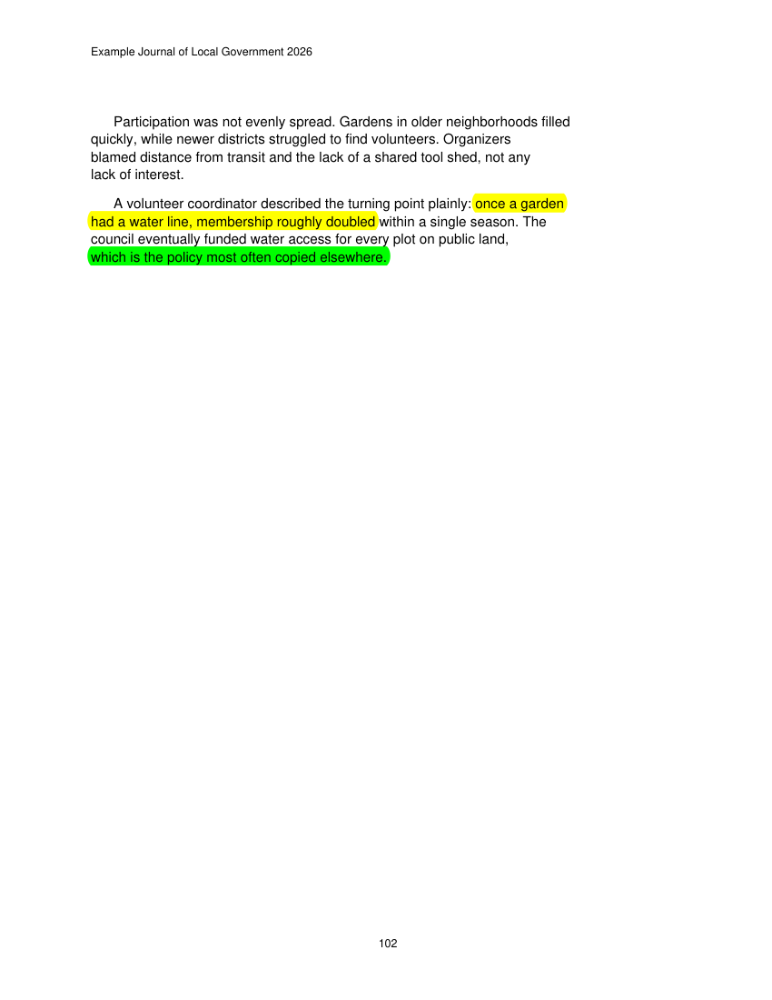
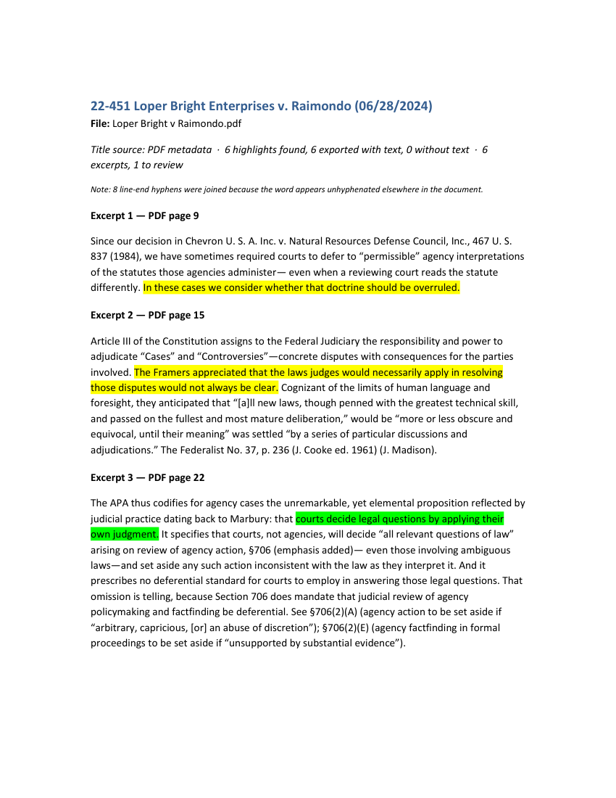

# Highlight Exporter

**Turn the highlights in your PDFs into an editable Word document, in seconds.**

It collects every passage you highlighted, the paragraph around it, and its page number, so you
stop copying and pasting.

> **Runs entirely on your computer.** Nothing is uploaded. No account, no AI service, no internet
> connection while it works. Your PDFs and highlights never leave your machine, and your PDFs are
> never changed.

## See it work

A 114-page Supreme Court opinion with six highlights was exported in about **one second**.

**Your PDF, highlighted as you read:**

**The Word document it creates.** The green passage above comes out in the same color, inside its
paragraph, with its page (PDF page 22 is printed page 14, as the page header shows):

The sample is [*Loper Bright Enterprises v. Raimondo*](https://www.supremecourt.gov/opinions/23pdf/22-451_7m58.pdf)
(2024). Both files are in `examples/`.

## Get it (Windows)

1. Install [Python 3.10 or newer](https://www.python.org/downloads/) once (tick "Add python.exe to PATH").
2. Download the zip from the [Releases page](../../releases/latest) and unzip it. Keep the folder together.
3. Double-click **Export Highlights.bat** and choose a PDF or a folder of PDFs.

The first run sets itself up (a minute, internet needed once). After that it works offline.

## What you get

- One Word file per PDF, with each highlighted passage in its paragraph, only the highlighted words
  emphasized (Word highlight color, or bold), and the PDF page number. The printed page number is
  added when the PDF reliably shows one, including documents whose numbering restarts in each
  section.
- Optional single combined file, and a report of anything skipped.
- A ⚠ **Review** note wherever it is unsure, such as a highlight that cuts a word in half. It never
  guesses silently.
- It never overwrites your files: if a name exists, the new file gets a date and time.

Options (one paragraph or the ones around it, bold, a combined file) are in `settings.json`.

## Limits

- Needs PDFs with real highlight annotations and selectable text. Scans without a text layer are
  reported, not exported.
- The text comes out plain: italics, fonts, and superscripts are not carried over (a footnote
  marker appears as an ordinary number after the word).
- Paragraph boundaries are a best guess from the layout. The highlighted words themselves come
  straight from the PDF, so check important quotations against the original.

## For developers

`python -m pip install -r requirements-dev.txt`, then `python -m pytest`. Code is in `highlight_export/`.

## License

[GNU AGPL-3.0](LICENSE): free to use, study, change, and share; modified versions you distribute (or
offer over a network) must share their source under the same license. No warranty.
